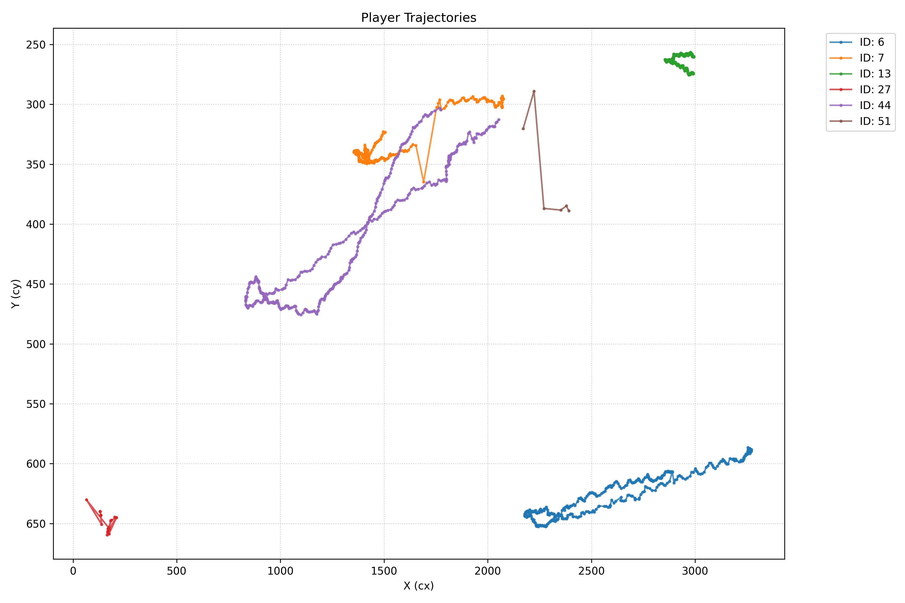
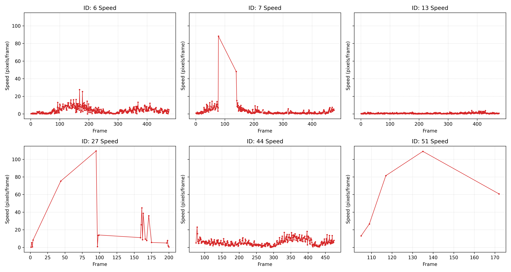

# トラッキングデータ分析レポート

## 課題1：可視化・理解

* **可視化した選手ID**
  * ID: 6, 7, 13, 27, 44, 51
* **軌跡の図**
   
* **動きの特徴**
  * ID 6, 13 は連続的で滑らかな軌跡を描いており、正常にトラッキングできている。
  * 一方で、ID 7, 27, 51 には不自然なジャンプが見られる。特に ID 7 は軌跡が途中で途切れ、そのすぐ近くから ID 44 の軌跡が始まっていることから、同一人物に対して新たなIDが割り当てられたと推測できる。
  * 実際、映像を確認したところ、開始3秒後程度で ID 7 が割り当てられていた選手の ID が 44 に更新されていることが確認できた。その後、付近の別の選手に ID 7 が割り当てられていた。

---

## 課題2：特徴量の改変

* **追加した特徴量**
  * 速度
   
* **計算方法**
  * Pandas の `groupby('id')` を用いてIDごとにデータをグループ化し、`diff()` 関数を用いて1フレーム前とのX座標・Y座標の差分（$v_x, v_y$）を算出した。その後、三平方の定理を用いてノルムを計算し、1フレームあたりの移動距離（pixels/frame）を求めた。
* **特徴量から分かったこと**
  * 正常なトラッキングができていたID（6, 13）では、速度の急激な変化や異常値がほとんどなく安定している。
  * しかし、速度の時系列グラフや異常値の抽出結果から、フレーム95でID 27 が、フレーム117, 135でID 51が、フレーム78でID 7が、それぞれ 80 pixels/frame 以上という大きな速度になっていることがわかった。これらは、トラッキングの誤検出やIDスイッチによるものと考えられる。
  * 実際、映像を確認したところ、例えば ID 27 はフレーム95あたりでID 44 に切り替わっていることが確認できた。