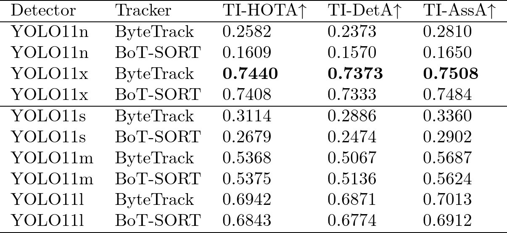
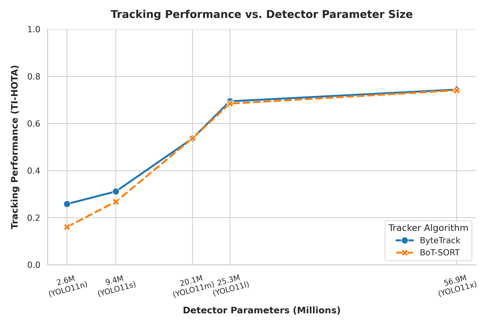

# What

This exercise is to do an Ablation Study on Detector and Tracking combination in the TrackID3x3 Notebook. The goal is to understand how different combinations of detectors and trackers affect the performance of the tracking system.

We compared the following combinations:
1. **Detector**: YOLOv11, with 5 different parameters scale (nano, small, medium, large, xlarge)
1. **Tracker**: ByteTrack and BoT-SORT
In total, we have 10 combinations (5 detectors x 2 trackers) to evaluate.

To evaluate the performance of each combination, we used the following metrics:
- TI-HOTA (Tracking Identity Higher Order Tracking Accuracy)
- TI-DetA (Tracking Identity Detection Accuracy)
- TI-AssA (Tracking Identity Association Accuracy)

We have executed the experiments on the given notebook and recorded the results for each combination of detector and tracker in the table below and with the visualizations of the tracking results.

This work use uv as python project manager. Please make sure uv is installed and configured in your environment. You can run following commands to set up the environment and run the code:

```bash
uv sync
uv run main.py
```

# Results

These videos show the tracking results for the best and the worst combination of detector and tracker. 

<div style="display: flex; justify-content: space-around;">
  <div>
    <h3>Best Combination</h3>
    <video width="320" height="240" controls>
      <source src="./basket_S1T3_pre_with_minimap_best.mp4" type="video/mp4">
      Your browser does not support the video tag.
    </video>
  </div>
  <div>
    <h3>Worst Combination</h3>
    <video width="320" height="240" controls>
      <source src="./basket_S1T3_pre_with_minimap_worst.mp4" type="video/mp4">
      Your browser does not support the video tag.
    </video>
  </div>
</div>

And here is the table summarizing the performance metrics for each combination of detector and tracker:



Among the combinations, we observed that the YOLO11 x-large detector combined with the ByteTrack tracker achieved the highest TI-HOTA, TI-DetA, and TI-AssA scores. On the other hand, the YOLO11 nano detector combined with the BoT-SORT tracker had the lowest performance, suggesting that the smaller scale detector may not be sufficient for accurate tracking in this context.



From the trend observed in the figure above, it is evident that as the scale of the YOLOv11 detector increases (from nano to x-large), there is a corresponding improvement in the tracking performance metrics (TI-HOTA, TI-DetA, and TI-AssA). This indicates that larger scale detectors are more effective in providing accurate detections, which in turn enhances the tracking performance when combined with either ByteTrack or BoT-SORT trackers.

In the case of the trackers, ByteTrack consistently outperformed BoT-SORT across all detector scales, suggesting that ByteTrack may be more robust in handling the detections provided by the YOLOv11 detectors. But then in the larger detector scales, the performance gap between ByteTrack and BoT-SORT narrows.

In conclusion, the task of Object Detection may be more important than the task of Association in this context, as the performance of the tracking system is heavily influenced by the quality of the detections provided by the YOLOv11 detectors. The choice of tracker also plays a significant role, with ByteTrack generally outperforming BoT-SORT, but the impact of the detector scale appears to contribute more in determining the overall tracking performance.