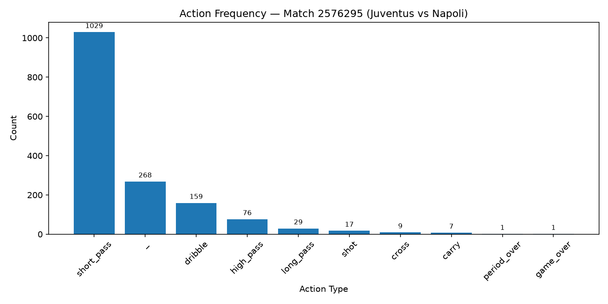
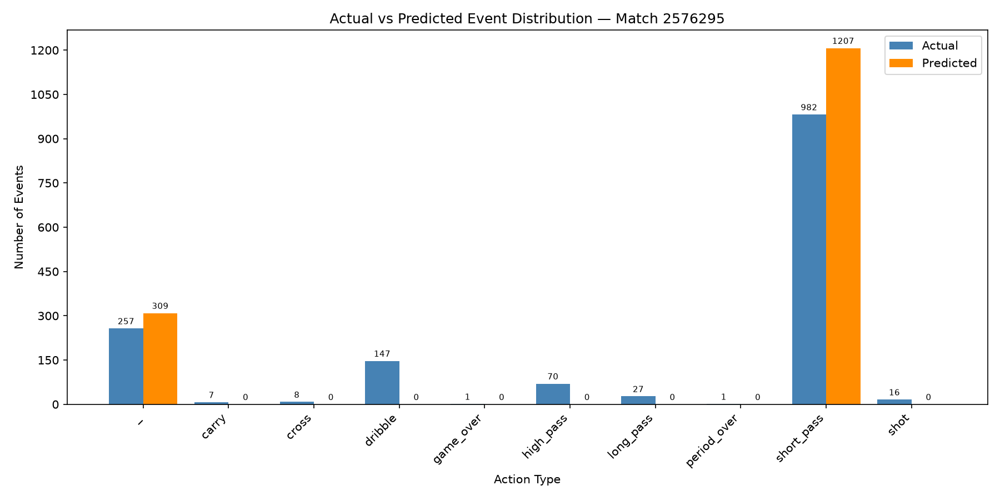
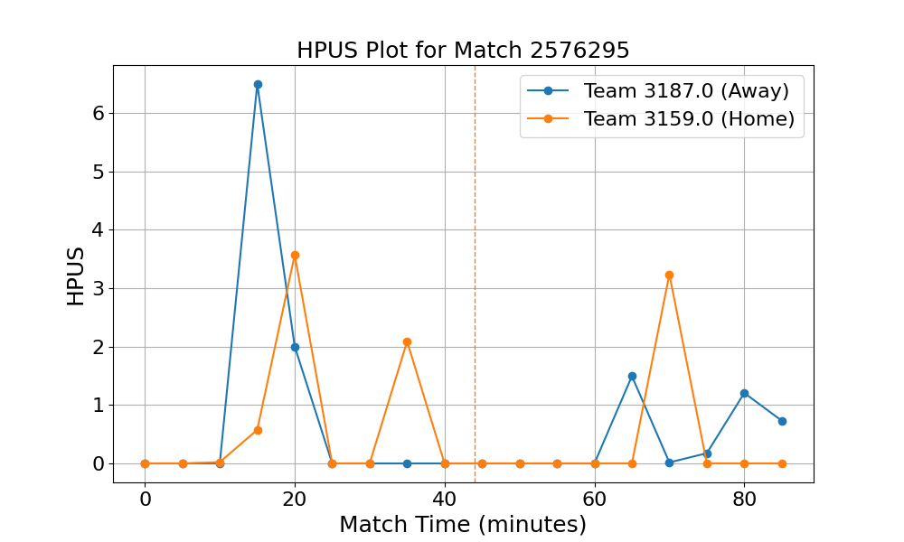
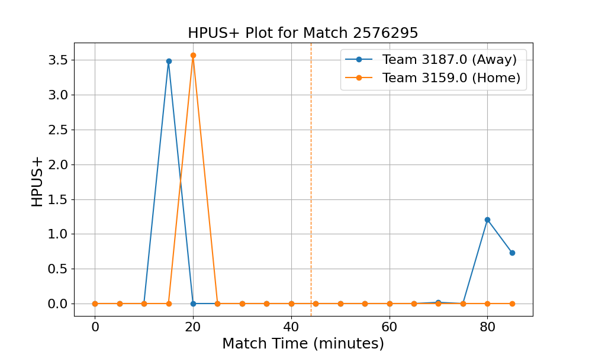

# Ex4 — Soccer Event Prediction with OpenSTARLab

This work modifies the notebook pipeline to include a non-English league, selects one match, runs inference with a pre-trained model, and visualizes the results.

**Target notebook:** [ex4/5.3_5.4_Soccer_Event_Preprocess_Modeling_OpenSTARLab.ipynb](../5.3_5.4_Soccer_Event_Preprocess_Modeling_OpenSTARLab.ipynb)

```bash
uv sync
uv run main.py
```

---

## Problem 1: Change in Preprocessing

### What changed

The original notebook filters the Wyscout dataset to keep only the English Premier League. The modification retains Serie A (Italy) instead by changing the league filter in the preprocessing step:

```python
# Original
competition_id = 364   # England

# Modified
competition_id = 524   # Italy (Serie A)
```

The `Event_data(..., preprocess_method="UIED")` pipeline was then re-run on the Italian league data, producing a new `data.csv`.

### Reprocessed data summary

| Metric | Value |
|--------|-------|
| League | Serie A (Italy) |
| Total events (`data.csv`) | 571,916 rows |
| Total matches | 380 |

---

## Tasks 2 & 3: Match Selection and Inference

### Selected match

| Field | Value |
|-------|-------|
| `match_id` | **2576295** |
| Match | **Juventus vs Napoli** |
| League | Serie A (Italy) |
| Events in inference output | 1,596 rows |

Juventus–Napoli was chosen as a high-profile Serie A fixture between two historically strong clubs, likely to show interesting tactical variety in event types.

### Inference settings

The pre-trained model (`_model_23.pth`) was loaded and `inference()` was called on the selected match. The test split (10% of matches, 38 matches total) included match 2576295.

### Model metrics (`loss_df`)

| Metric | Value |
|--------|-------|
| `train_loss` | 5.0116 |
| `CEL_action` | 1.044 |
| `RMSE_deltaT` | 0.2406 |
| `RMSE_location` | 0.2764 |
| `ACC_action` | **0.6599** |
| `F1_action` | **0.1634** |
| `MAE_deltaT` | 3.2085 s |
| `MAE_x` | 8.9964 m |
| `MAE_y` | 17.7722 m |

The large gap between ACC (66%) and F1 (0.16) indicates class imbalance. The model collapses to predicting the most frequent classes and ignores rarer ones.

---

## Task 4: Visual Analysis

### 4.1 Action Frequency



The match is dominated by `short_pass` (1,029 events, ~64% of all events), followed by `_` (null/transition, 268) and `dribble` (159). Rare actions include `carry` (7), `cross` (9), and terminal events `game_over`/`period_over` (1 each). This extreme class imbalance is the root cause of the model's poor F1 score.

### 4.2 Actual vs Predicted Event Distribution



The left panel shows the actual event distribution; the right panel shows what the model predicted. Key observations:

- The model only predicts two classes: `short_pass` (1,207 times) and `_` (309 times)
- It never predicts `dribble`, `high_pass`, `long_pass`, `cross`, `carry`, or `shot`
- `short_pass` is over-predicted (1,207 predicted vs 982 actual in rows with predictions)
- All other action types are completely missed

This behaviour confirms the model is biased toward the dominant class in training data.

### 4.3 HPUS and HPUS+

**HPUS (Holistic Possession Utilization Score)** evaluates the efficiency and effectiveness of team possession. HPUS factors in *where* on the pitch events happen, *what actions* occur, and the *time elapsed* between them.

**HPUS+** is the goal-adjusted variant. It only assigns value to possession sequences that ultimately ended in a goal, making it a stricter measure of how well a team converts dangerous build-up into actual scoring.




Observations from the Juventus vs Napoli match:

- **Team 3187 (Away) — minute ~15 (HPUS ≈ 6.5):** The away team produced the match's highest-value possession sequence in the opening phase, suggesting an early attacking spell that generated significant threat through progressive ball movement.
- **Team 3159 (Home) — minutes 20–35 and ~70:** The home team's pressure was more distributed, with moderate-value possessions spread across the first half and a late second-half spike around minute 70.
- **Second half drop-off:** Both teams' HPUS falls toward zero after minute 75, consistent with a more defensive, low-risk phase typical of late-match game management.
- **HPUS+ near zero for most of the match:** Despite the possession pressure shown by HPUS, almost none of these sequences converted into goals. This gap between HPUS and HPUS+ highlights that both teams struggled to finish their dangerous build-up play.

---
